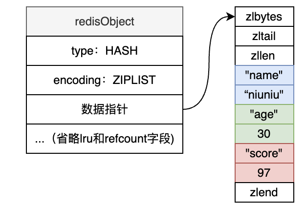
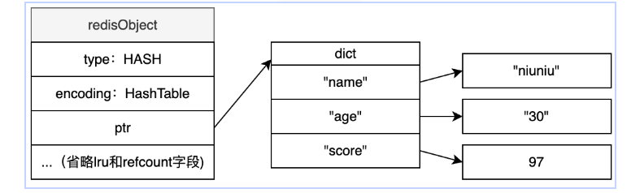

# Hash

Hash是一个field value都是string的hash表

## 适用场景

适合用于O(1)字典查找某个field对应数据的场景, 比如任务信息的配置, 可以任务类型做field, 任务配置参数为value

## 常用操作

### 写操作

#### HSET

``` shell
HSET key field value [field value ...]
```

#### HSETNX

``` shell
HSET key field value [field value ...]
```

如果field不存在则为集合对应fied设置value

#### HDEL

``` shell
HDEL key field [field ...]
```

删除指定field

#### DEL

``` shell
DEL key
```

删除Hash

### 读操作

#### HGETALL

``` shell
HGETALL key
```

查找全部数据

#### HGET

``` shell
HGET key field
```

查找field对应value

#### HLEN

``` shell
HLEN key
```

返回Hash中元素总数

#### HSCAN

``` shell
HSCAN key cursor [MATCH pattern] [COUNT count]
```

从指定位置查询一定数量的数据, 如果是小数据量, 处于ZIPLIST, 不管count多少都是返回全部

## 编码格式

当Haash对象保存的键值长度都小于64字节

Hash对象元素个数小于512个

使用ZIPLIST



有任一条不满足, 使用HASHTABLE

