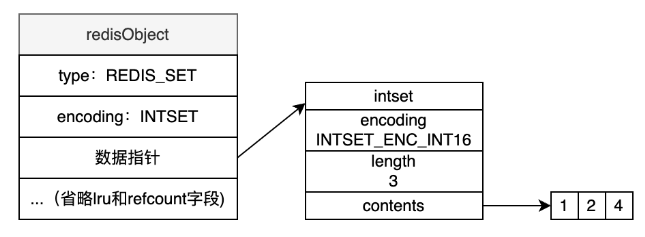
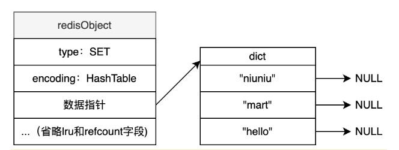

# Set

## 定义

不重复无序的字符串集合(如果是INTSET编码则为有序)

## 适用场景

适用于无序集合场景, 如某个用户关注了哪些公众号, Set还提供并, 交集, 可以很方便实现共同关注功能

## 常用操作

### 写操作

#### SADD

``` shell
SADD key member [member ...]
```

返回值为添加成功了几个元素


#### SREM

``` shell
SREM key member [member ...]
```

返回值为删除成功了几个元素

### 读操作

#### SISMEMBER

``` shell
SISMENBER key member
```

查询member是否存在

#### SCARD

``` shell
SCARD key
```

返回set有几个元素

#### SMEMBERS

``` shell 
SMEMBER key
```

查看set所有元素

#### SSCAN

``` shell
SSCAN key cursor [MATCH pattern] [COUNT count]
```

从游标处查询n个元素, n默认为10

#### SINTER

``` shell
SINTER key [key ...]
```

返回第一个集合中,同时在后面所有集合存在的元素

#### SUNION

``` shell
SUNION key [key ...]
```

返回所有集合的并集

#### SDIFF

``` shell
SDIFF key [key ...]
```

返回第一个集合有, 且后续集合都没有的元素

## 底层实现

如果集群元素都为整数且元素数量不超过512个, 使用INTSET编码:



INTSET排列紧凑, 内存占用少, 查询时使用二分查找


如果不满足INTSET, 使用HASHTABLE:



查找性能很高, O(1)