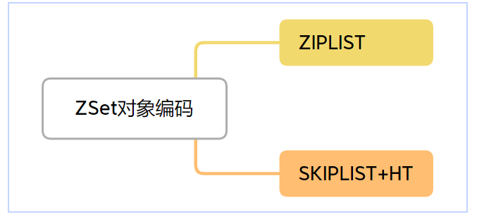

# Zset

ZSet就是有序集合, 按照关联积分有序的字符串集合,  积分相同的情况下按字典序排序

## 适用场景

用于需要排序集合的场景, 比如游戏排行榜

## 常用操作

### 读操作

#### ZADD

``` go
ZADD key score member [score member ...]
```

扩展参数: 

XX: 仅更新存在的成员, 不添加

NX: 只添加, 不更新存在的成员

LT:更新新的分值比当前分值小的成员, 不存在则新增

GT: 更新新的分值比当前分值大的成员, 不存在则新增

``` shell
127.0.0.1:6379> flushdb
OK
127.0.0.1:6379> zadd myzset 5 five
(integer) 1
127.0.0.1:6379> zadd myzset 6 six
(integer) 1
# GT: 4不大于5，更新失败
127.0.0.1:6379>  zadd myzset GT 4 five
(integer) 0
# LT: 4小于5，更新成功
127.0.0.1:6379> zadd myzset LT 4 six
(integer) 0
127.0.0.1:6379> zrange myzset 0 -1 withscores
1) "six"
2) "4"
3) "five"
4) "5"
```

#### ZREM

``` shell
ZREM key member [member ...]
```

删除ZSet中的元素

### 写操作

#### ZCARD

``` shell
ZCARD key
```

返回ZSet成员总量

#### ZRANGE

``` shell
ZRANGE key start stop [WITHSCORES]
```

查询从start到stop范围的数据

``` shell
ZADD myZSet 1 "member1"
ZADD myZSet 2 "member2"
ZADD myZSet 3 "member3"
ZADD myZSet 4 "member4"
ZADD myZSet 5 "member5"

ZRANGE myZSet 0 2

1) "member1"
2) "member2"
3) "member3"

ZRANGE myZSet 0 -1 WITHSCORES

1) "member1"
2) "1"
3) "member2"
4) "2"
5) "member3"
6) "3"
7) "member4"
8) "4"
9) "member5"
10) "5"
```


#### ZREVRANGE

``` shell
ZREVRANGE key start stop [WITHSCORES]
```

从大到小遍历

####  ZCOUNT

``` shell
ZCOUNT key min max
```

返回范围内成员个数

#### ZRANK

``` shell
ZRANK key member
```

查询当前成员的排名索引

#### ZSCORE

``` shell
ZSCORE key member
```

查询ZSet成员分数

## 编码方式



当列表保存的字符串对象长度都小于64字节且列表对象元素个数少于128个, **使用ZIPLIST**

任意一条不满足使用SKIPLIST+HT

HASHTABLE用来配合查询, 可以在O(1)时间复杂度查到成员的分数值

