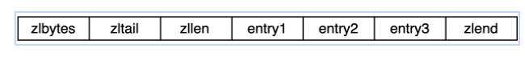
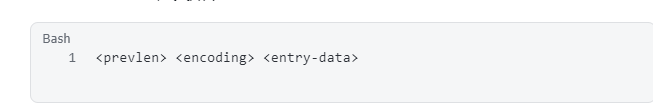
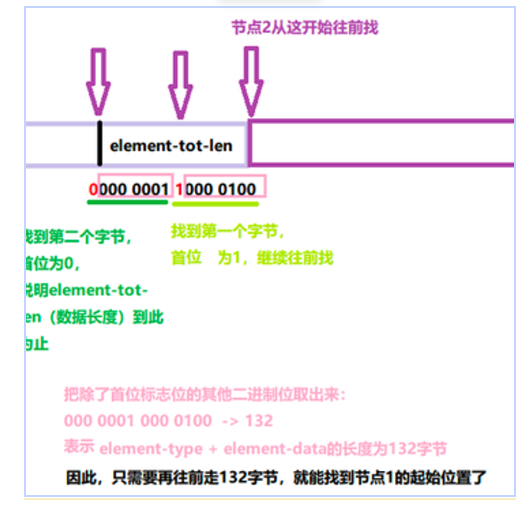

## ZIPLIST

### ZIPLIST结构

ZIPLIST是紧凑型双端列表, 分配在一块连续的内存空间, 不同类型有不同的编码方式和存储长度

整体结构:

节点结构:

prevlen: 表示上一节点数据长度, 如果上一节点数据长度小于254字节, 那么用一字节长的空间存储这个值, 如果大于等于254字节, 用五字节长的空间存储这个值(255是特殊字符, 被zlend使用), 五字节中第一个字节是254, 标志这是5字节长度的prevlen, 剩下四字节表示大小

encoding: 编码类型, 包含entry的长度信息, 用于正向遍历(如果是string类型, encoding有两部分, 前几位标识类型, 后几位标识长度, int类型自带长度, 如int16, int32)

### 查询数据

- 查询总量: 一般为O(n), 当长度小于65535, 直接从zllen获得, 大于等于65535, 真实节点数量需要遍历获得
- 查询指定数据节点: 需要遍历一遍, O(n)

### 更新数据

ZIPLIST是双端列表, 当头插时, 需要把后面节点都往后移, O(n)

插入时有可能会导致连锁更新, 比如当头插的entry长度大于等于254, 则不仅要将后面的节点后移, 还需要迭代更新后面节点的prevlen

## LISTPACK

主要为了解决ZIPLIST连锁更新的痛点

不记录prevlen, 而是用一个element-tot-len来存储整个节点除它自身的长度

element-tot-len每个字节的第一位用于表示是否结束, 剩下7bit来存储数据大小

当前节点一直往前读element-tot-len, 读完之后可以获得上一节点起始位置距当前的长度, 即可获得上一节点的起始位置

