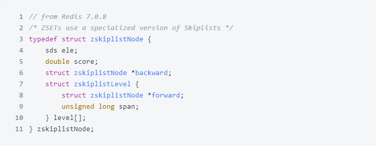

## 跳表

跳表本质还是链表

对于有序列表, 增删改查复杂度都为O(n)

跳表就是在链表的基础上, 增加多级索引, 通过索引可以实现多个节点的跳跃, 提高性能

## Redis跳表的结构

与标准跳表的区别在于底层是双向链表, 且score可重复

用level数组来实现每层的索引

## 层次的决定

层次的决定比较随机

redis跳表决定每一个节点,增加一层的概率是25%, 最大层数限制在5.0是64层, 在7.0是32层

## 跳表的性能优化

从O(N)降到log(N)