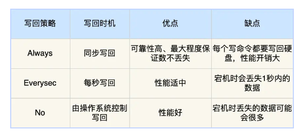

## RDB(redis database)

本质是redis的数据快照, redis默认开启RDB, RDB文件存在dump.rdb

### 持久化时机

1. 执行save
2. 执行bgsave
3. 达到持久化配置阈值
4. 程序正常关闭时

### 流程

1. fork一个子进程进行RDB
2. 子进程写数据到临时RDB文件
3. 写完之后用新的RDB文件替换旧的RDB文件

通过子进程来进行RDB, 配合写时复制, 相当于异步执行, 将对执行流程的影响降到最低

## AOF(append only file)

### AOF写入流程

请求到来, 先处理请求, 再写入AOF, 每条日志都会写入AOF, 刷盘策略可以自己设置

redis建议方案二, 可以按需选择

### AOF重写

AOF是不断写入的, 当文件体积过大, 会自动在后台fork一个子进程进行重写, 实际上就是对相同key的操作进行合并. 

重写流程为一次拷贝, 两处缓冲:

- 重写发生时, 主进程会fork一个子进程, 共享redis物理内存, 让子进程讲这些内存写入重写日志
- 当重写时, 有新的写入命令执行, 会有主进程分别写入AOF缓冲和AOF重写缓冲, 前者是用于保证此时宕机原来的AOF日志也是完整的, 后者是用于保证新的AOF文件也不会丢失最新的写入操作