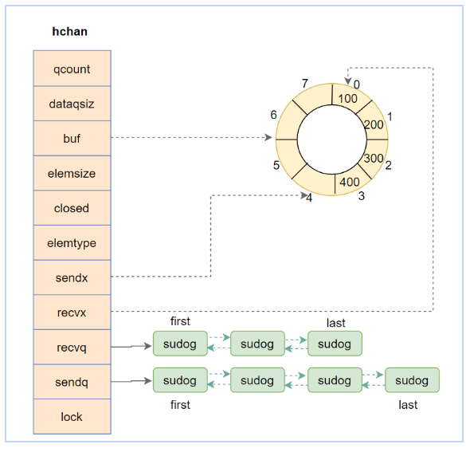
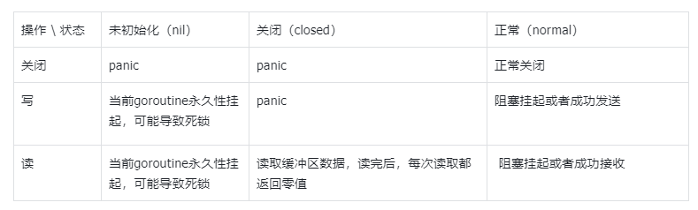

## 基础相关：

### golang 中 make 和 new 的区别？（基本必问）

make和new是用于创建对象的两个不同的函数, 

1. make只能用于创建slice map chan(因为这三个都是引用类型, 在使用时需要初始化), 而new可以用于任意类型的创建
2. make的返回值是该类型本身, 而new的返回值是指向该类型的指针
3. make创建的变量是根据类型进行初始化, new创建的变量是零值

### 进程、线程、协程有什么区别？

 进程是程序运行的一个实例, 是计算机分配资源的基本单位, 线程是进程中的一个执行单元, 是操作系统调度的基本单位. 进程独占一个虚拟内从空间, 而进程中的所有线程共享一个进程虚拟存储空间, 线程的粒度更小, 一个进程可以有多个线程

协程可以理解为用户态线程, 跟线程的区别主要有三个方面

1. 协程大小为2K, 可以动态扩容, 而线程大小为2M, 协程更轻量
2. 线程切换需要用户态到内核态的切换, 而协程不用, 只在用户态完成,  协程切换消耗更小(线程切换需要保存各种寄存器, 而协程切换只需要保存rsp, rip, rbp)
3. 线程调度有操作系统完成, 而协程调度由运行时的调度器完成

### 数组和切片的区别 （基本必问），切片怎么扩容

数组是值类型, 长度固定, 而切片是引用类型, 长度不固定, 可以动态扩容

1.17之前

- 如果预估容量大于当前容量的两倍, 就会使用期望容量
- 如果当前切片容量小于1024, 就会将容量翻倍
- 如果当前切片容量大于1024, 就会每次增加25%, 直到新容量大于期望容量

1.18之后


``` go
//扩容公式
newcap = oldcap + (oldcap + 3 * 256)/4
```


### go defer，多个 defer 的顺序，defer 在什么时机会修改返回值？（defer 和 return）

defer执行顺序是后进先出, 先被注册的defer会最后执行, defer函数在注册的时候, 创建的\_defer结构会依次插入到\_defer链表的表头, 当前函数return的时候, 依次从链表表头取出\_defer结构, 执行里面的函数, 所以是LIFO

return可以分为三步:

1. 设置返回值
2. 执行defer
3. 将结果返回

### uint 类型溢出


`uint` 类型是循环的，当超过其最大值时会回绕到从0开始

###  介绍 rune 类型

rune是go用来表示unicode字符的数据类型, 实际是int32的别名, 用来区分字符和整数值. 使用单引号定义, 

### golang 中解析 tag 是怎么实现的？反射原理是什么？(问的很少，但是代码中用的多)


### go struct 能不能比较？

对于不同类型的struct无法比较, 相同类型的struct只有每一个成员都可比较才可以比较

在go中, slice map func无法比较, 当struct成员包含任意一个都无法比较

### Go 闭包是什么？你是怎么理解的？

闭包实际上就是函数+捕获变量, 可以引用外部定义的变量

匿名函数也可以被称为闭包

### Go 多返回值怎么实现的？


### Go 语言中不同的类型如何比较是否相等？

reflect包提供的深度对比(递归)的方法，适用于go中的slice,map，struct，function的对比

- 相同类型的值是深度相等的，不同类型的值永远不会深度相等。
- 当数组值`array`的对应元素深度相等时，数组值是深度相等的。
- 当结构体`struct`值如果其对应的字段（包括导出和未导出的字段）都是深度相等的，则该值是深度相等的。
- 当函数`func`值如果都是零，则是深度相等；否则就不是深度相等。
- 当接口`interface`值如果持有深度相等的具体值，则深度相等。
- 当切片`slice`序号相同，如果值,指针都相等，那么就是深度相等的
- 当哈希表`map`相同的key，如果值，指针都相等，那么就是深度相等的

### Go 中 init 函数的特征?

1. 每个包可以有多个init, 每个文件也可以有多个init, 多个init函数按照他们文件名顺序和定义的顺序逐个执行
2. 应用初始化工作的顺序是, 从被导入的最深层包开始初始化, 层层递出到main包
   1. 不管包被导入多少次, init函数只会执行一次
   2. 包级别变量的初始化先于包内init函数的执行

> 执行顺序: import -> const -> var -> init() -> main()

### Go 中 uintptr 和 unsafe.Pointer 的区别？

1. unsafe.Pointer 是通用指针类型, 它不能参与计算, 任何类型的指针都可以转换为unsafe.Pointer, unsafe.Pointer可以转换为任何类型的指针
   1. 当我们想要通用指针之间进行转换时, 就需要unsafe.Pointer作为中间指针
2. uintptr与unsafe.Pointer可以互相转换,,uintptr是指针运算的工具, 用于保存指针的整数表示, 但并不持有只针对象. (可以把指针转换为uintptr进行数值运算, 然后转换回原类型)


### 空 struct{} 占用空间么？有什么用

不占用任何空间

1. 将map作为集合(set)来使用,可以将值类型定义为空结构体, 表示只在乎键是否存在

   ``` go
   package main
   
   import "fmt"
   
   func main() {
       // 使用空结构体表示集合的存在
       set := make(map[string]struct{})
   
       // 添加元素
       set["apple"] = struct{}{}
       set["banana"] = struct{}{}
       set["orange"] = struct{}{}
   
       // 检查元素是否存在
       fmt.Println("Is 'apple' in the set?", set["apple"])   // true
       fmt.Println("Is 'grape' in the set?", set["grape"])   // false
   
       // 遍历集合
       fmt.Println("Elements in the set:")
       for key := range set {
           fmt.Println(key)
       }
   }
   ```

2. 不发送数据的信道(channel)

   使用channel不发送任何数据, 只用来通知或控制协程并发度

3. 结构体只包含方法, 不包含任何字段


## Context 相关：

### context 结构是什么样的？

context是一个接口, 提供四个方法

``` go
type Context interface {
    Deadline() (deadline time.Time, ok bool) 	// 设置截止时间
    Done() <-chan struct{}						// 返回一个channel, 如果当前context已被关闭货到达截止时间, 这个channel会被关闭, 用于表示该context是否结束.
    Err() error									// 返回此context结束的原因
    Value(key interface{}) interface{}			// 从context中获取键对应的值
}
```

canncel接口是为: 

``` go
type canceler interface {
	cancel(removeFromParent bool, err error)	//创建conceler接口实例的goroutine, 可以调用cancel方法通知被创建的gorouting退出
	Done() <-chan struct{}						//返回一个channel, 后续被创建的goroutine可以通过监听这个channel来完成退出
}
```

有emptyCtx, cancelCtx, timerCtx, valueCtx四种实现

- emptyCtx: emptyCtx虽然实现了context接口, 但不具备任何功能, 基本就是返回空值
  - context.Background()和context.TODO()都是返回一个*emptyCtx的动态类型
- cancelCtx: cancelCtx实现了context和canceler接口, 通过取消函数cancelFunc实现退出通知, 注意退出通知不但通知自己, 同时通知其他zigoroutine
  - 调用context.WithCancel() 会返回一个*cancelCtx和cancelFunc
- timerCtx: timerCtx是实现context接口的实例, 同时内部封装了cancelCtx实例, 不仅可以定时通知, 还可以通过cancelFunc进行通知
  - context.WithTimeout()返回*timerCtx和cancelFunc, 是多少秒后通知
  - context.withDeadline() 返回*timerCtx和cancelFunc, 是什么时间通知(用Timeout实现)
- valueCtx:实现context接口的实例, 同时封装了k/v的存储变量, 实现数据传递
  - context.WithValue() 返回*valueCtx, 子valueCtx可以继承parent valueCtx的k/v

### context 使用场景和用途？（基本必问）

1. 主要用来在goroutine之间传递上下文信息, 比如传递请求的trace_id, 以便于追踪全局唯一请求
2. 还可以用来做取消控制, 通过取消信号和超市时间来控制子goroutine的退出, 防止goroutine泄露

## Channel 相关：

### channel 是否线程安全？锁用在什么地方？

是线程安全的, 对channel一般只有读写关闭三种操作, 对于这三种操作, channel底层数据结构都用同一把runtime.Mutex来进行保护


### go channel 的底层实现原理 （数据结构）

对于有缓冲的channel:

底层是hchan, 里面有一个指向循环数组的指针, 用来存储数据, 由sendx和recvx来维护读写位置

用两个队列sendq和recvq, 当有goroutine对这个channel读写阻塞的时候放在对应的队列

用一个mutex来实现读写关闭操作的线程安全



### nil、关闭的 channel、有数据的 channel，再进行读、写、关闭会怎么样？（各类变种题型）



### 向 channel 发送数据和从 channel 读数据的流程是什么样的？

- 读操作

  - 成功读取:

    <span style="color:red">如果channel有数据, 直接读取, 并且检查写等待队列是否有goroutine, 若有需要将对头goroutine数据放入channel并唤醒这个goroutine</span>

    <span style="color:purple">如果channel没数据, 尝试从写等待队列对头goroutine读取数据, 并唤醒该goroutine</span>

  - 阻塞挂起:

    channel没有数据, 且写等待队列为空, 则将当前goroutine加入读等待队列, 并挂起等待唤醒

- 写操作

  - 成功写入

    如果读等待队列不为空, 则取队头goroutine, 将值直接复制给该goroutine, 并将其唤醒

    如果读等待队列为空, 则尝试放入环形缓冲中

  - 阻塞挂起

    读等待队列为空且通道里面无法存放数据, 则放入写等待队列, 并挂起等待唤醒

## Map 相关：

### map 使用注意的点，并发安全？

map不是并发安全的, 当有任务对map进行写操作, 其他任务不能对map执行并发操作, 否则会造成fatalerror, 这种错误无法被recover捕获, 可以在并发读写的情景加锁. 在查找赋值遍历删除过程中都会检测写标志, 一旦发现写标志为1, 则直接fatal退出程序. 赋值和删除函数在检测写标志是0之后, 先将写标志改成1, 才会进行之后的操作

### map 循环是有序的还是无序的？

无序的. 每次遍历会从一个随机值序号的桶, 从选定的随机槽位开始遍历, 所以是无序的.

因为map是可以动态扩容的, 扩容后会发生key的迁移, 原先在同一个桶内的key, 迁移后会发生改变. 如果按顺序遍历bucket中的key, 迁移后key的位置会发生变化, 再遍历的话结果就不一样了, 所以强制每次遍历都是随机的

### map 如何顺序读取？

可以把key放到切片中排序, 再按照排序后的key遍历map

### map 中删除一个 key，它的内存会释放么？

不会, 删除一个key, 是将它标记为删除, 修改key对应内存位置的值为空, 并不会释放内存 ,只有置空这个map的时候, 整个空间才会被GC释放

> 删除key时 是根据key的hash值找到对应的槽位, 将key置空并将对应的tophash置为emptyOne, 如果后面没有任何数据了, 则将emptyOne设为emptyReset

### 怎么处理对 map 进行并发访问？有没有其他方案？ 区别是什么？

可以在进行并发读写的时候加锁, (读写锁), 或者Sync.Map

### nil map 和空 map 有何不同？

未初始化的map为nilmap

- 往nil map添加, 会触发panic
- 读取不会报错
- 删除不会报错

已经初始化, 没有任何元素的map为空map, 对空map增删改查不会报错

### map 的数据结构是什么？是怎么实现扩容？

map实际是一个hash表, 运行时表现为指向hmap结构的指针, hmap中有一个buckets指针, 指向bmap数组, bmap数组每个元素是一个bmap叫做桶的结构, 每个桶中放有八个tophash和八对key value, 以及指向下一个溢出桶的指针. 同时hmap中也有指向溢出桶的指针.

扩容时机:

​	向map插入新key的时候, 会进行条件检测, 符合两个条件会触发扩容

	1. 当map元素个数 > 6.5*桶个数, 触发双倍扩容
	1. 当溢出桶数量过多, 触发等量扩容(溢出桶 >= min(桶总数, 2^15))

扩容机制:

1. 双倍:新建一个长度为原busckets二倍大小的新buckets数组, 将旧的buckets数据迁移到新的buckets.
2. 等量扩容:并不扩容, 将松散的键值对重新排列, 使buckets内key排列更紧密.

扩容方式:

扩容不是一次性进行的, 采用渐进式扩容, 每次插入修改删除key的时候, 都会尝试进行迁移, 每次检测oldbuckets是否为nil, 不是nil则迁移两个桶, 一个是当前访问的, 一个是oldbuckets指向的.

### map 的key为什么要是可比较的类型？


## sync.map相关

### read map什么时候会更新？


### dirty map什么时候会更新？


### read map 和 dirty map的删除逻辑又什么区别？


### 那既然在删除read的时候没有删除这个key，而dirty覆盖的时候又只覆盖了read，那么加入dirty中也存在这个key，这个key是不是会被遗漏，没有删掉，导致内存泄漏？

### sync.Map中的read和dirty有什么关系？

### sync.Map中的值是否一定是有效的？

### sync.Map 应用场景？

## GMP 相关：

### 什么是 GMP？（必问）调度过程是什么样的？（对流程熟悉，要求更高，问的较少）

### p的数量有限制吗？m的数量有限制吗？g的数量有限制吗？

### 进程、线程、协程有什么区别？

### 抢占式调度是如何抢占的？

## sync相关：

### 除了 mutex 以外还有那些方式安全读写共享变量？

atomic也可以安全读写, mutex是以锁的形式来保证代码段的并发安全, atomic是

### Go 如何实现原子操作？

### 原子操作和锁的区别

### Mutex 是悲观锁还是乐观锁？悲观锁、乐观锁是什么？

### 互斥锁mutex底层是怎么实现的？

### Mutex 有几种模式？

### goroutine 的自旋占用资源如何解决

### 读写锁底层是怎么实现的

### Mutex 已经被一个 Goroutine 获取了, 其它等待中的 Goroutine 们只能一直等待。那么等这个锁释放后，等待中的 Goroutine 中哪一个会优先获取 Mutex 呢?

### waitgroup 是怎样实现协程等待？

### sync.Once 的原理，是怎样保证代码段只执行1次？
## 并发相关：
### 怎么控制并发数？
### 多个 goroutine 对同一个 map 写会 panic吗，异常是否可以用 defer 捕获？
### 如何优雅的实现一个 goroutine 池（百度、手写代码）
### select 可以用于什么？
### 主协程如何等其余协程完再操作？
## GC 相关：

### go gc 是怎么实现的？（必问）

### GC 中 stw 时机，各个阶段是如何解决的？ 

### GC 的触发时机？

### GC扫描的根节点有哪些
  ## 内存相关：

### 谈谈内存泄露，什么情况下内存会泄露？怎么定位排查内存泄漏问题？

### 知道 golang 的内存逃逸吗？什么情况下会发生内存逃逸？

### 请简述 Go 是如何分配内存的？

### Channel 分配在栈上还是堆上？哪些对象分配在堆上，哪些对象分配在栈上？

### 介绍一下大对象小对象，什么情况下会导致GC压力大

## 代码题相关

### 使用三个协程，每秒钟打印cat dog fish（要求：顺序不能变化，协程1打印cat，协程2打印dog，协程3打印fish）

### 实现两个协程轮流输出A 1 B 2 C 3 .... Z 26

### N个 Goroutine循环打印数字 min - max（需要多多练习）
## Go代码性能优化：

### 你知道Go的哪些性能优化手段

